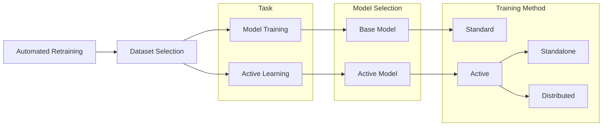

# Automated Retraining Framework: Build, Test, and Deploy Efficient Neural Network Models with Active Learning Workflows

This repo contains code to train, fine-tune, and develop active learning workflows with models using data such as visual imagery.

A simple configuration file allows models, datasets, active learning parameters, and training hyperparameters to be changed without modifying the underlying code itself. If needed, custom models and datasets may be added by building off the base classes in the Automated Retraining Framework. 

## Workflows
There are three standardized workflows which may be used individually to build, test, and deploy models. 



### Model Training 
The `automated_training.trainers` module provides flexibility in training neural network models from scratch. Features such as early stopping and tensorboard logs are built in, and custom features may be implemented by extending the `BaseTrainer` class. Model checkpoints may also be used for fine-tuning or transfer learning. Experiment logs and checkpoints are versioned and saved alongside the training hyperparameters to facilitate good ML-ops practices. 

### Standalone Active Learning
The submodule `ActiveLearningStandalone` serves as an intermediate step between training and distributed active learning workflows. Most notably, it is helpful in debugging the active learning loop consisting of dataset creation, model selection from checkpoints, data querying, model retraining, and model state estimation. Each step in the active learning loop may be extended and customized by building new modules from appropriate base classes, providing flexibility in developing new algorithms and workflows. 

### Distributed Active Learning
Two modules, namely `EdgeModule` and `DataCenterModule`, enable active learning workflows to be tested in a distributed setting. In the demo setting, these two submodules may be used to simulate the separation of the edge and datacenter components while not actually placing either onto a separate machine. Running distributed active learning in demo mode simulates this separation by implementing edge or datacenter routines in their respective classes. For example, the `EdgeModule` implements the processing of incoming data and querying of data for retraining, while the `DataCenterModule` implements model selection, model state estimation, and model retraining. 

Another mode of running distributed active learning is with module communication through a localhost server. In this mode, the edge and datacenter modules are run in two distinct shell sessions. An input parameter `--mode` selects between the edge and datacenter modules. 


## Config File Setup

Each workflow has specific parameters that must be set in their respective config file, as well as additional optional parameters to enable features such as early stopping and checkpoint milestones during training. As custom modules are build for models, datasets, and active learning algorithms, it is encouraged to any extra parameters to the config file that may be needed.

As an example, a configuration file may look like: 

```yaml
---
config: training
model_config:
  model_name: MNISTModel
  architecture: resnet18
training_params:
  batch_size: 64
  weight_decay: 0.0002
  lr: 0.1
  gamma: 0.1
  momentum: 0.9
training_config:
  with_validation: true
  results_dir: "./logs"
  experiment: MNIST-training
  max_epochs: 100
  early_stopping: true
  stopping_metric: validation/epoch_loss
  patience: 10
  device: cuda
dataset_config:
  datamodule: MNISTDataModule
  dataset_dir: "/datasets/MNIST/"
  n_samples: 10000
  num_classes:
    digit: 10
```

The top key `config` specifies which mode to run in
* training
* active_learning_standalone
* active_learning_distributed

The subsequent dictionaries are used to configure the other modules with required and optional parameters. 

At the beginning of any workflow, the required config file parameters will be checked against built-in tests to ensure the environment has been set up properly. 


## Examples

### Training
Make sure the top key `config` is set to `training` and run:
```python
python main.py --config ./configs/base_config.yaml
```

### Standalone Active Learning
Make sure the top key `config` is set to `active_learning_standalone` and run:
```python
python main.py --config ./configs/active_config.yaml
```

### Distributed Active Learning (demo mode)
Make sure the top key `config` is set to `active_learning_distributed` and run:
```python
python main.py --config ./configs/active_config.yaml
```
### Distributed Active Learning (localhost mode)
Make sure the top key `config` is set to `active_learning_distributed`. In one terminal, run:
```python
python main.py --config ./configs/active_config.yaml --mode datacenter
```
and in a second terminal on the same machine, run:
```python
python main.py --config ./configs/active_config.yaml --mode edge
```
This will will start the edge and datacenter systems and begin transmitting data and models back and forth between the two processes.
