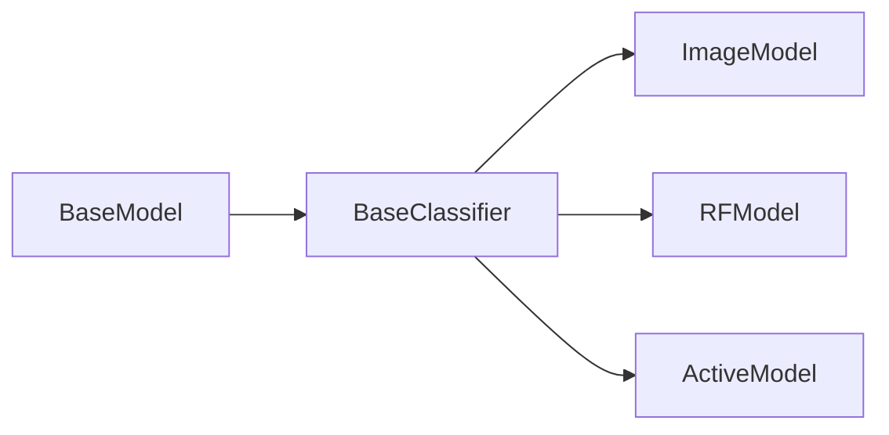

# Models

The directory contains classes/functions for building models for working with datasets.

## BaseModel
`BaseModel` which provides the basic structure for implementing a custom model with standard methods.

Every `BaseModel` instance will have a `loss`, `forward`, `validate`, `metrics`, `compute_metrics`, and `load_model` method, described below.

To ensure consistency across the repository, `loss`, `forward`, and `validate` all expect a batch (data, labels) as input.

* `loss`: Define custom loss function for the model
* `forward`: Define what happens during a forward pass of the model. 
* `validate`: Define how to validate performance of model 
* `metrics`: Define which metrics to evaluate. should return a list of torchmetrics which should be computed.
* `compute_metrics`: compute metrics returned by the `metrics` method.
* `load_model`: Allows user to load a model from the `architectures` directory.  When loading model from architectures in this repository, some of the methods may already be defined. 

## BaseClassifier
The BaseClassifier serves as a starting point for classification based models. It comes pre-loaded with a `train_acc` and `val_acc` metric: `torchmetrics.Accuracy()`, as well as corresponding loss functions: `torch.nn.CrossEntropyLoss()`. 

Additionally, the `loss`, `forward`, `validate` and `metrics` methods are all defined in the standard way. Note that `metrics` will need to be computed in a custom implementation. 

As new or additional metrics are added, `compute_metrics` should be updated to accept the new metric type.

An `ActiveModel` class is also available which inherits from the `BasesClassifier` and has additional methods specific to active learning. 

Building models may follow the following flow, where `ImageModel` and `RFModel` and user defined model classes. 

## Models in practice (example: MNISTModel)
New models may be created by first creating a custom class and inheriting from the `BaseModel` class. Typically, additional arguments from a config file are added to the model as keyword arguments through the kwargs parameter. standard inputs are `model_config`, `dataset_config`.

In the example model `MNISTModel`, the input parameters are a `num_classes` dictionary, and the config parameters `model_config` and `dataset_config`. The `MNISTModel` loads a predefined model architecture with the `load_model` method. 

Once the custom model class is defined, it should be added to the `__init__.py` file, so it may be selected during training or active learning.

To use a custom model during training or active learning, the parameter `model_name` under `model_config` in the configuration `.yaml` file must be updated. 

