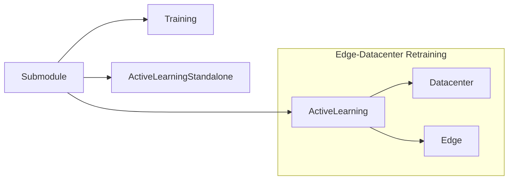

# Submodules

The directory contains submodules that perform high-level operations in the automated retraining toolkit.

Submodules perform system level operations, including configuration, and communication. 
From a configuration file, submodules create a `dataset`, a `model`, and a `trainer` module, and then run their specified workflow. 
 
 
## Modes of Operation: 
 
There are three modes of operation, namely: Training, Active Learning Standalone, and Edge-Datacenter Retraining.



 
### Training: 
A training module is implemented that performs end-to-end training and fine-tuning. In the configuration file two dictionaries 
specify the training settings. The `training_params` define the optimization hyperparameters, and the `training_config` 
defines parameters of the training run  
 
```yaml
    training_params:
        batch_size: 64
        weight_decay: 0.0002
        lr: 0.1
        gamma: 0.1
        momentum: 0.9
    training_config:
        with_validation: true
        results_dir: "./logs/"
        experiment: E2D
        max_epochs: 1000
        device: cuda
        early_stopping: true
        stopping_metric: validation/epoch_loss
        patience: 10
        use_milestones: true
        log_interval: 10
        save_best: true
        saving_metric: validation/epoch_loss
```

 
### Active Learning Standalone:
In the active learning standalone mode the `ActiveTrainer` trainer is used with one of the implemented `query_strategies` to 
perform active learning to improve the performance of a pretrained model on a specific dataset efficiently. 
 
### Edge - Data Center Retraining: 
In the edge - data center retraining mode two submodules, the edge and the data center submodules, work together to perform 
active learning. In this mode, the edge queries the data it currently has access to for samples to send to the data center
which performs training on the samples. This configuration implements an Automated Retraining system for a deep learning model
running on an edge device, where retraining is necessary due to changing environments yet training is too compute intensive to 
be done at the edge. 
 
The `active_params` in the configuration file specify the operation of the active learning, including the active learning 
query strategy to use, as well as the number of samples to query per round. 
 
```yaml
    active_params:
        n_query: 20
        n_iter: 3
        strategy: EntropySampling
        model_selection_method: LEEP
        state_estimation_method: ExpectedCalibrationError
        state_estimation_host: datacenter
        chkpt_dir: "./checkpoints/al_checkpoints/"
        starting_chkpt: "./checkpoints/al_checkpoints/mnist/mnist_resnet18_red.pt" 
```

