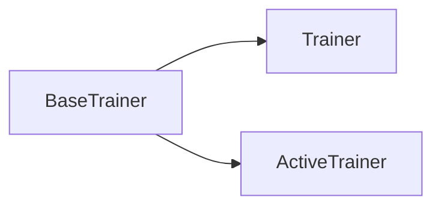

# Trainers

The directory contains classes/functions for building trainers that train a model in a specific way, e.g. via active learning

Trainers are used to facilitate the training of models in standard and active learning modes of operation. The `BaseTrainer` class contains the training loop logic, as well as functionality for early stopping, logging to tensorboard, and evaluating models with test data. The `Trainer` and `ActiveTrainer` classes are extensions of the base class built for standard training, and active learning respectively. 



The `Trainer` class is a small extension of the `BaseClass` and only adds an extra attribute for saving model checkpoints to a specific directory, named by: `Model Architecture + Dataset Name + Experiment Name + Epoch Number`.

The `ActiveTrainer` implements tools specific to active learning, and takes either a single model or list of models as its `model` input. Included in this class are two methods used to select and set the active model using a `model_selection` metric using, e.g., LEEP or LogME. Additionally, a standalone active learning loop is implemented which is useful for testing query strategies, model selection methods, and other active learning specific configuration parameters that may impact performance. 


## Building a trainer

The `BaseTrainer` requires a `model`, `training_config`, `train_loader`, and `val_loader`. The model used for training should align with the trainer, e.g.: `ActiveModel` -> `ActiveTrainer`. 

The `train_loader` and optional `val_loader` are callable PyTorch Datalaoders, created in the dataset which load the training data and validation data respectively. Typically, these use `dataset.train_dataloader()` and `dataset.val_dataloader()`, however any dataloader may be passed in.

The `training_config` provides all information relevant to training, with required arguments: 

```yaml
training_config:
  with_validation: true
  results_dir: "./results"
  experiment: EfficientTraining
  max_epochs: 1000
  device: cuda
```

Example configuration parameters for early stopping and saving the best model checkpoints: 
```yaml
training_config:
  with_validation: true
  results_dir: "./results"
  experiment: EfficientTraining
  max_epochs: 1000
  device: cuda
  early_stopping: true
  stopping_metric: validation/epoch_loss
  patience: 10
  save_best: true
  saving_metric: validation/epoch_loss
  use_milestones: true
  log_interval: 10
```
